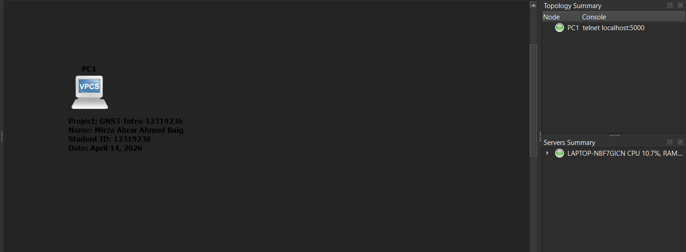
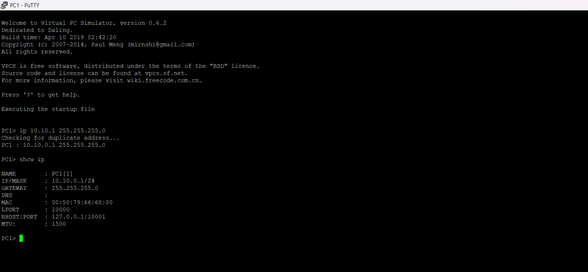

# Week 01 Portfolio - Mirza Abrar Ahmed Baig

## Student Information
- **Name:** Mirza Abrar Ahmed Baig
- **Student ID:** 12319236
- **Unit:** COIT20261
- **Date:** April 14, 2026

## Task 1: GNS3 Basics

### Learning Outcomes
- Created GNS3 project: GNS3-Intro-12319236
- Added VPCS Linux Host node
- Configured static IP address: 10.10.1.1/24
- Successfully started node and verified IP via console

### Commands Used
| Command | Purpose |
|---------|---------|
| `ip 10.10.1.1 255.255.255.0` | Set static IP address on VPCS |
| `show ip` | Verify IP configuration |
| `save` | Save configuration |

### Screenshots

### Reflection
Successfully configured a Linux host with static IP 10.10.1.1 using GNS3. Understood how to set IP addresses manually and verify connectivity. VPCS is a simple yet effective tool for basic host simulation.

