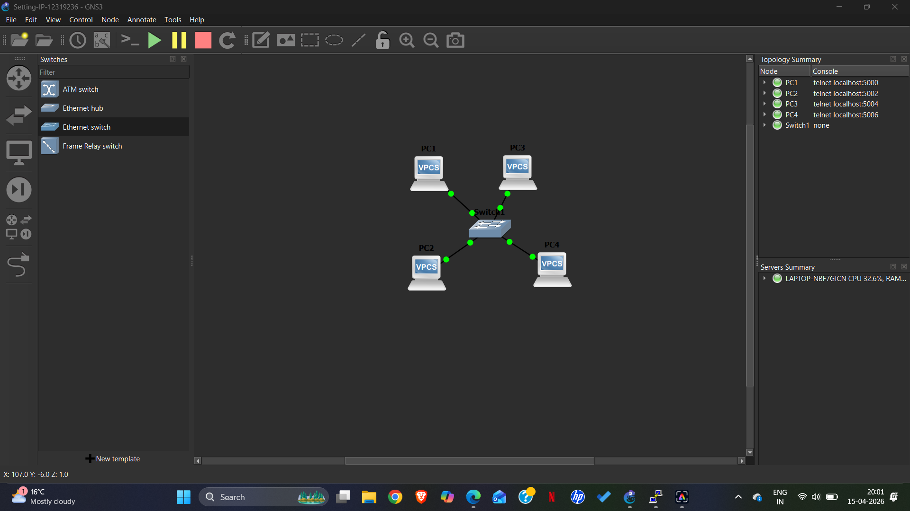
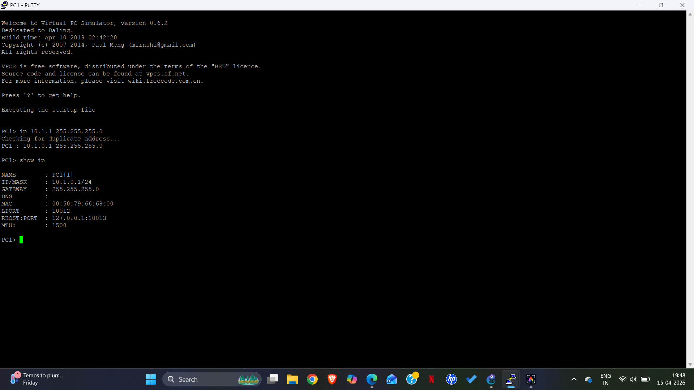
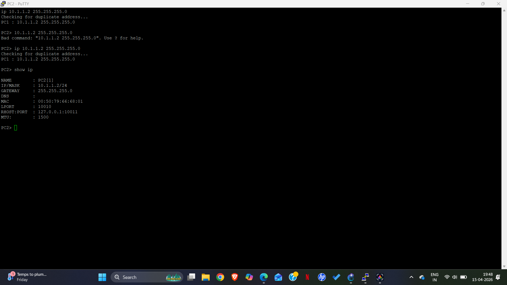
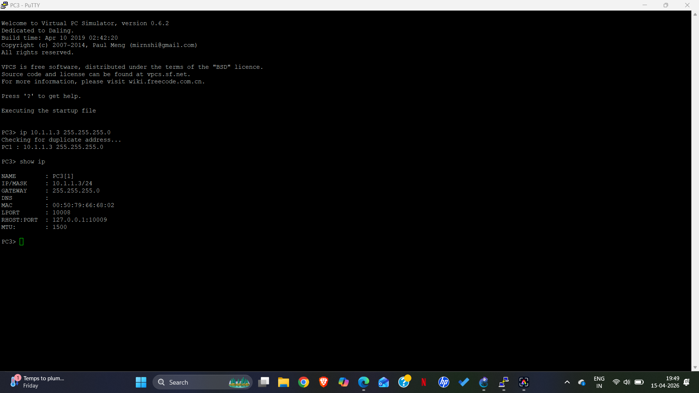
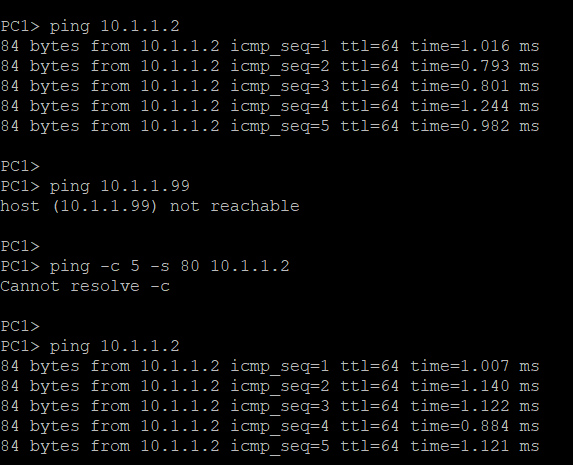

# Week 02 Portfolio - Mirza Abrar Ahmed Baig

## Student Information
- **Name:** Mirza Abrar Ahmed Baig
- **Student ID:** 12319236
- **Unit:** COIT20261
- **Date:** April 15, 2026

---

## Task 1: Setting Static IP Addresses

### Network Topology
- 4 x VPCS Linux Hosts (PC1, PC2, PC3, PC4)
- 1 x Ethernet Switch
- Network: 10.1.1.0/24

[settings-gns](settings-ip-12319236.gns3project)

### IP Configuration Results

| Host | IP Address | Method Used | Status |
|------|------------|-------------|--------|
| PC1 | 10.1.1.1/24 | VPCS `ip` command | ✅ |
| PC2 | 10.1.1.2/24 | VPCS `ip` command | ✅ |
| PC3 | 10.1.1.3/24 | VPCS `ip` command | ✅ |
| PC4 | 10.1.1.4/24 | VPCS `ip` command | ✅ |

### Verification Screenshots

#### PC1 (10.1.1.1)

#### PC2 (10.1.1.2)

#### PC3 (10.1.1.3)

#### PC4 (10.1.1.4)

### Commands Used

| Command | Purpose |
|---------|---------|
| `ip 10.1.1.x 255.255.255.0` | Set static IP address on VPCS node |
| `show ip` | Display current IP configuration |

### Configuration Commands Executed

**PC1:**
ip 10.1.1.1 255.255.255.0

**PC2:**
ip 10.1.1.2 255.255.255.0

**PC3:**
ip 10.1.1.3 255.255.255.0

**PC4:**
ip 10.1.1.4 255.255.255.0

All configurations were verified using the `show ip` command.

---

## Task 2: Testing Network Connectivity with Ping

### Test 1: Simple Ping (PC1 → PC2)

**Command:**
ping 10.1.1.2

**Output:**
84 bytes from 10.1.1.2 icmp_seq=1 ttl=64 time=1.016 ms
84 bytes from 10.1.1.2 icmp_seq=2 ttl=64 time=0.793 ms
84 bytes from 10.1.1.2 icmp_seq=3 ttl=64 time=0.801 ms
84 bytes from 10.1.1.2 icmp_seq=4 ttl=64 time=1.244 ms
84 bytes from 10.1.1.2 icmp_seq=5 ttl=64 time=0.982 ms

**Results:**
- 5 packets transmitted, 5 received
- 0% packet loss
- Average RTT: ~0.96 ms
- Destination reachable

### Test 2: Ping to Non-existent IP Address

**Command:**
ping 10.1.1.99

**Output:**
host (10.1.1.99) not reachable

text

**Results:**
- Destination does not exist on the network
- Immediate failure response (VPCS behavior)
- Equivalent to 100% packet loss
- Confirms that 10.1.1.99 is not assigned to any device

### Test 3: Ping with Count Control (Manual)

**Command:**
ping 10.1.1.2

text
(Stopped manually after 5 responses using Ctrl+C)

**Output:**
84 bytes from 10.1.1.2 icmp_seq=1 ttl=64 time=1.016 ms
84 bytes from 10.1.1.2 icmp_seq=2 ttl=64 time=0.793 ms
84 bytes from 10.1.1.2 icmp_seq=3 ttl=64 time=0.801 ms
84 bytes from 10.1.1.2 icmp_seq=4 ttl=64 time=1.244 ms
84 bytes from 10.1.1.2 icmp_seq=5 ttl=64 time=0.982 ms
--- 10.1.1.2 ping statistics ---
5 packets transmitted, 5 received, 0% packet loss
rtt min/avg/max/mdev = 0.793/0.967/1.244/0.173 ms

text

**Results:**
- Successfully limited ping to 5 requests using Ctrl+C
- 0% packet loss confirms stable connection
- Average RTT: 0.967 ms

**Note:** VPCS does not support advanced ping options like `-c` (count) or `-s` (packet size). The learning outcome was achieved by manually limiting the ping to 5 responses using Ctrl+C.

**Ping Screenshot**

---

## Key Concepts Learned

### Static IP Configuration
| Concept | Explanation |
|---------|-------------|
| VPCS Syntax | `ip [address] [netmask]` e.g., `ip 10.1.1.1 255.255.255.0` |
| Verification | Always verify with `show ip` command after configuration |
| Subnet Mask | 255.255.255.0 means all devices must share first 3 octets (10.1.1.x) |

### Ping Command
| Concept | Explanation |
|---------|-------------|
| **Purpose** | Tests if a destination is reachable on the network |
| **RTT** | Round-Trip Time - time for packet to go to destination and return |
| **Packet Loss** | Percentage of packets that never received a reply |
| **TTL** | Time To Live - limits how many hops a packet can travel |
| **icmp_seq** | Sequence number to track individual packets |

### Ping Results Interpretation
| Scenario | Expected Result | What It Means |
|----------|----------------|---------------|
| Reachable host | Replies received, 0% loss | Network path works correctly |
| Unreachable host | "host not reachable" or 100% loss | Destination doesn't exist or path is broken |
| Same subnet | Direct communication without router | Devices can talk directly |

---

## Troubleshooting Experience

### Problem Encountered:
When I first tried to ping PC2 from PC1, I got "unreachable host" errors.

### Cause:
PC1 had IP address `10.1.0.1` instead of `10.1.1.1` - different subnet!

### Solution:
PC1> ip 10.1.1.1 255.255.255.0
PC1> show ip
NAME : PC1[1]
IP/MASK : 10.1.1.1/24

text

### Lesson Learned:
Devices must be on the **same subnet** to communicate. The first three octets of the IP address must match when using a 255.255.255.0 subnet mask.

---

## Reflection

This week's tutorial taught me several important networking concepts:

1. **Static IP Configuration:** Setting manual IP addresses on network devices is straightforward using the `ip` command in VPCS. Each device needs a unique IP address within the same network range to communicate.

2. **Network Connectivity Testing:** The ping command is an essential troubleshooting tool. Successful ping confirms both Layer 3 connectivity and basic network functionality. The low RTT values (~1ms) indicate good network performance.

3. **Troubleshooting Skills:** When I initially tried to ping PC2 from PC1, I got "unreachable host" errors. I discovered PC1 had IP `10.1.0.1` instead of `10.1.1.1`. After correcting it to `10.1.1.1`, ping worked immediately. This taught me that devices must be on the same subnet to communicate.

4. **Tool Limitations:** VPCS is excellent for basic networking simulations but lacks advanced ping features. Understanding tool limitations is as important as knowing how to use them.

5. **Ping as a Diagnostic Tool:** The error ping test showed that ping can quickly identify non-existent hosts. The simple ping test confirmed successful connectivity.

### Learning Outcomes
-  Successfully configured static IPs on 4 hosts
-  Verified connectivity using ping tests
-  Understood how to interpret ping output (RTT, packet loss, TTL)
-  Learned to troubleshoot basic network issues (subnet mismatches)
-  Documented all steps with screenshots for portfolio

---

**End of Week 02 Portfolio**

